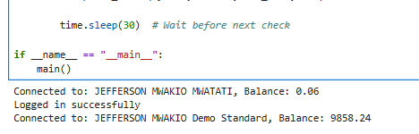
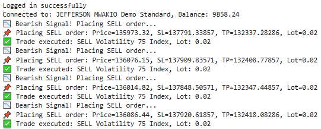
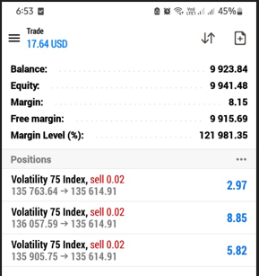
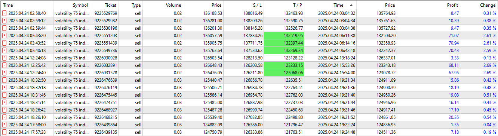
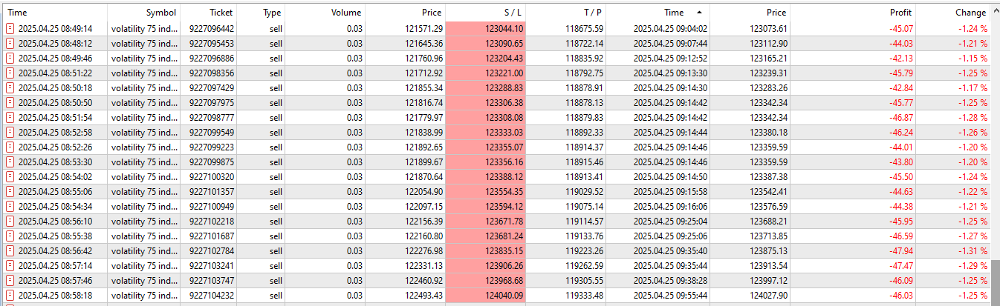
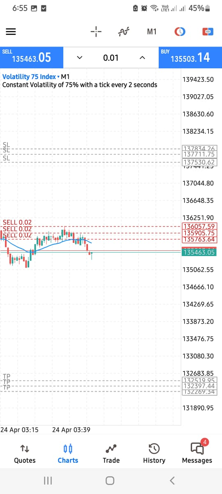
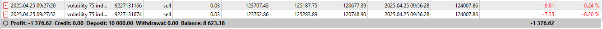
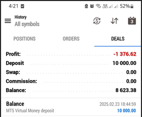

# Project: Forex Trading Algorithm
#### **April, 2025** 
#### [**By Mr. Jefferson Mwatati**](https://github.com/jeffersonmwatati)
Combining my interest in **Finance** and **Investment** with my **Tech skills**, I’m developing a **Forex trading tool** using **Python**. The **algorithm** will integrate **technical indicators** and **news analytics** to deliver smart, automated **trading strategies** for improved **decision-making** and **risk management**.

***Note: No code will be shared here, only documentation, experience, screenshots, and steps taken on the journey to build the Algorithm***

## Target 1: Log in to Broker Account on MetaTrader 5
This objective focuses on establishing a secure and reliable connection to MetaTrader 5 (MT5) trading account through the use of Python. The following steps are involved:
   1. **Initialize MT5 Connection:** Specify the explicit path to the MetaTrader 5 terminal on the local system.
   2. **Login to MT5 Account:** Authenticate using trading account credentials.
   3. **Set Broker Details:** Define the broker's server name to ensure the terminal connects to the correct trading environment.
**Results**  
I'm using **Python** in a **Jupyter Notebook** to connect to my **Deriv demo account** on **MetaTrader 5 (MT5)**. After a successful login, the algorithm prints the **account name**, **type**, and **current balance**.
The screenshot below confirms the login and data retrieval were successful.

  

## Target 2: Auto Trade Execution
After login, the algorithm places trades automatically by fetching live market data, detecting trends, and calculating **RSI** and **ATR** indicators.
**Results**  
The results confirm that the algorithm successfully identifies trade signals (e.g., bearish trends), calculates trade parameters such as **entry price, stop loss (SL), take profit (TP), and lot size**, and then executes the trade on MetaTrader 5. The output messages verify that the trade was placed as intended, demonstrating the algorithm's ability to respond to market conditions in real time.

  

## Target 3: Evaluate Algorithm Performance
At this stage, I focus on confirming the performance of the current algorithm. Since the goal is to develop a **scalping strategy**, I assess how well it identifies quick trade opportunities, executes them efficiently, and manages risk in fast-moving market conditions.

**Results**  

  

  

  

  

  

  

**Recommendations**  

